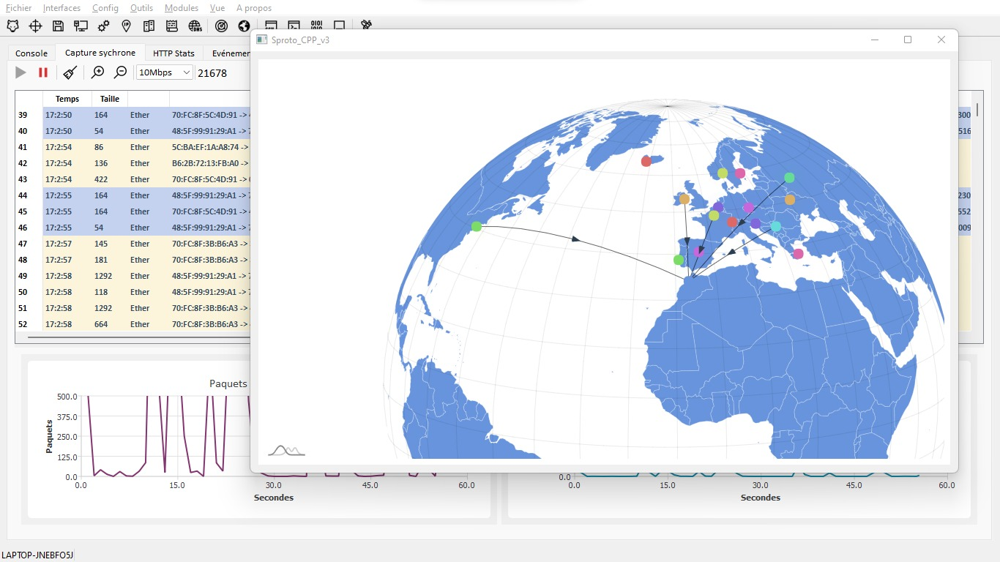

# S-Prototype - *A "SIEM from scratch" project* 🌠🛰️​
*@Xacone - 2021*

S-Prototype is a project on which I worked on in 2021 and which enabled me to improve my C++, Win32 APIs & QT skills. It is a light-weight SIEM that processes and aggregates real-time data from software agents located on other machines, such as real-time packet capture and analysis, as well as events occurring on the system, while providing an ergonomic graphical interface that enables real-time monitoring of events and processed information.
  
⏸️ Development of this project is currently on hold. 

---

<b> <i>Geolocation of remote hosts with which a connection is established</i> 🌍​</b>   

 
<b> <i>Real Time Packets Capture</i> 🛜​</b>   

https://github.com/Xacone/S-Prototype/assets/76184111/2f7768cd-a732-4200-81de-92afa48858ac

 
<b> <i>Catching Nmap XMAS scans</i> 🔍</b>   

https://github.com/Xacone/S-Prototype/assets/76184111/756ff460-5959-4e08-a35f-5f1e64292812

 
<b> <i>Real time HTTP traffic summary</i> 📊​</b>   

https://github.com/Xacone/S-Prototype/assets/76184111/f2de9c9c-db98-4193-87e1-6f602f8e87c2

